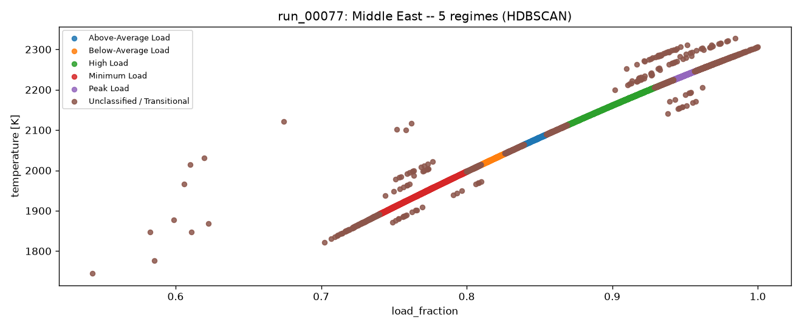

# SPECTRA

**S**teady **P**oint **E**xtraction and **C**lustering for **T**ransient **R**egime **A**nalysis

A framework for combustion time-series analysis: extracting steady-state
operating points from transient data and automatically grouping them.

## Phase 1: simulation

Before evaluating any extraction/clustering technique, we need labeled
transient-to-steady time-series data. `spectra` simulates a large gas
turbine's combustion chamber as a 0-D Cantera reactor network (GRI-Mech 3.0
chemistry, CH4/H2 fuel blends) over a **30-day period** at 15 s resolution,
following realistic grid electricity demand for one of 9 world regions
(United States, Canada, Central America, South America, Europe, Middle East,
Russia, China, India). On top of the demand-following dispatch, each run
carries the things that keep a real plant from ever sitting perfectly still:

- **Irregular dispatch**: the load target is re-dispatched every 15-60 min
  through the morning/evening demand ramps, every 1-4 h otherwise, with an
  8% chance of a 2-10 min real-time correction. That's ~580 setpoint
  changes per run, each ramped at a per-run rate of 2-6% of full load per
  minute with no overshoot.
- **Disturbances** (1-3 per day): *runbacks* (a fast 15-35% load cut, a
  short hold, then recovery), *fuel shifts* (a fuel heating-value drift
  that settles phi at a new level for 20-90 min), and *combustion dynamics*
  (a few minutes of phi oscillation, roughly the size of the sensor noise).
- **AGC wander**: continuous automatic-generation-control corrections, an
  Ornstein-Uhlenbeck process on load with a per-run amplitude (0.2-1.5% of
  full load) and correlation time (1-5 min). Some units barely regulate;
  others regulate hard.

Ambient temperature follows the region's diurnal/seasonal climate. Engine
design parameters (pressure ratio, reference mass flow, combustor volume,
fuel blend, site elevation) are Latin-hypercube sampled across runs.

**Ground truth.** A sample is labeled steady when the dispatch ramp has
finished, no disturbance transient is in progress, and the commanded
operating point has stayed inside a +/-0.5%-of-full-load band (and the
equivalent phi band) over the trailing 60 s. Stability is judged on the
signal's own recent history, so a detector can in principle recover it: on
the noise-free commanded signal, a signal-only check reproduces the labels
at MCC 0.87-0.99. Across the 200 runs the steady fraction ranges from 37%
(units regulating hard) to 98%, median 89%.

Each run is written with both the ground truth and a noisy "observed" trace,
plus per-timestep `segment_id` / `is_steady` / `disturbance` labels to score
extraction methods against.

```bash
uv run spectra sweep --n-cases 200 --out datasets --workers 3 --fine-dt 15 --coarse-dt 15 --fine-window 0
```

Each run takes ~100 s and peaks at ~800 MB, so keep `--workers` within your
memory budget. Labels can be recomputed in place without re-running the
physics: `.venv/bin/python scripts/relabel_steady.py`.

Output: one directory per run, `datasets/<run_id>/`, containing:

- `data.parquet`: the time series (truth + noisy observed columns, plus
  per-timestep `segment_id` / `is_steady` / `disturbance` ground truth)
- `conditions.txt`: region, simulated date range, site/engine parameters,
  control-schedule setpoints, dispatch-interval and ramp statistics, AGC
  parameters, disturbance counts, and a daily summary table of ambient
  temperature / load / phi / adiabatic flame temperature over the 30 days
- `temperature.png`: chamber temperature (TIT proxy) vs. the equilibrium
  adiabatic flame temperature, over the full 30-day run
- `emissions.png`: NOx and CO (converted from tracked species mass
  fractions to molar ppm) over the full 30-day run

### Regional climate & demand profiles

Each run is assigned one of 9 world regions, which drives both its ambient
temperature cycle and its grid-demand shape (`src/sim/regions.py`,
`src/sim/demand.py`). What makes each region distinct:

| Region | Climate (summer / winter high) | Diurnal swing | Demand peak(s) | Diurnal shape | Peak:trough |
|---|---|---|---|---|---|
| United States | 31°C / -2°C | 9°C | Summer (Jul, +32%), secondary winter (Jan, +15%) | Double (morning+evening) | 1.7x |
| Canada | 27°C / -3.5°C | 9°C | Winter (Jan, +25%), secondary summer (Jul, +10%) | Double | 1.5x |
| Central America | 32°C / 30.5°C | 6°C | Mild dry-season uptick (Feb, +8%) | Double | 1.5x |
| South America | 29°C / 15°C | 8°C | Summer (Jan, +20%) + winter (Jul, +18%), hemisphere-inverted | Double | 1.6x |
| Europe | 25°C / 4.5°C | 8°C | Winter (Jan, +20%), secondary summer (Jul, +10%) | Double | 1.5x |
| Middle East | 43.5°C / 21.5°C | 13°C | Summer (Jul, +50%), most extreme | Single midday/AC | 1.9x |
| Russia | 23°C / -6.5°C | 8°C | Winter (Jan, +30%) only | Double (flatter) | 1.4x |
| China | 33°C / 2.5°C | 9°C | Summer (Jul, +25%) + winter (Jan, +15%), increasingly bimodal | Double | 1.6x |
| India | 41.5°C / 21°C | 10°C | Summer (May, +35%), dips in monsoon | Single midday/AC | 1.9x |

What actually differs between regions, physically:

- **Climate** (summer/winter means + diurnal swing) sets the compressor
  inlet temperature cycle, which directly moves adiabatic flame temperature
  and achievable firing temperature for a given fuel/air ratio.
- **Demand peak magnitude and month** sets how far above baseline the
  dispatched load climbs, and when within the 30-day window. Each run's
  start date is randomized, so different runs land on different parts of
  the regional seasonal curve.
- **Diurnal shape**: "double" (morning + evening peaks, trough overnight)
  vs. "single_midday" (one broad AC-driven plateau through the
  afternoon/evening). This changes the actual shape of the daily cycle in
  the TIT trace.
- **Peak:trough ratio** sets how deep the overnight minimum runs relative
  to the daily peak.

A full example run per region is included under `samples/<region>/`
(`conditions.txt`, `temperature.png`, `emissions.png`; `data.parquet`
omitted, ~30MB/run). Three contrasting examples:

**United States**: double-peak, summer-dominant, moderate swing


**Middle East**: single-peak (AC-driven), one broad daily plateau and the
largest peak:trough ratio in the table (1.9x)


**Russia**: double-peak, with the lowest peak:trough ratio in the table
(1.4x), so a shallower daily swing than the AC-driven regions, since winter
heating demand persists through the night


The remaining 6 regions (Canada, Central America, South America, Europe,
China, India) follow the same pattern and are available under their own
`samples/<region>/` directory.

## Phase 2: steady-window detection (indsl)

Goal: reliably detect a continuous **>=60-second steady window** in the
noisy "observed" trace. Ground truth for this is derived from the
simulator's per-sample `is_steady` label via a rolling 60s AND (`src/eval/labels.py`):
a point only counts as a valid steady window if every sample in the
preceding 60 seconds was also steady.

All 8 univariate detectors in [indsl.detect](https://indsl.docs.cognite.com/detect.html),
plus calibrated variants of `ssd_cpd` and `cusum` and an `always_steady`
baseline, were run against 4 channels (chamber temperature, pressure, air
mass flow, phi) across a 40-run held-out sample (`src/eval/methods.py`,
`run_eval.py`). In this sample, 65.2% of samples are inside a true 60 s
steady window.

**Metric.** The headline metric is MCC (Matthews correlation coefficient):
1 is perfect, 0 is no better than chance, and any constant predictor
("always steady" or "never steady") scores exactly 0. F1 on the steady class
can't be the headline. At a 65% base rate, `always_steady` scores F1 = 0.758
without detecting anything, and an F1-tuned detector simply converges on
that trivial answer.

**Calibration** (`src/eval/calibrate.py`): `ssd_cpd` (per channel) and
`cusum` (one global setting, scaled to each series' noise floor) were
grid-searched by MCC on a held-out 5-run slice, distinct from the 40
evaluation runs.

**Results** (mean MCC over 40 runs):

| Method | temperature | mass flow | phi | pressure | overall MCC | balanced acc. | F1 |
|---|---|---|---|---|---|---|---|
| `cpd_ed_pelt` | 0.115 | 0.140 | 0.162 | skipped | **0.139** | 0.522 | 0.760 |
| `cusum_tuned` | **0.177** | **0.164** | 0.078 | 0.000 | 0.105 | **0.554** | 0.662 |
| `ssid` | 0.094 | 0.164 | 0.071 | 0.000 | 0.082 | 0.523 | 0.628 |
| `vma` | 0.047 | 0.095 | 0.117 | 0.000 | 0.065 | 0.544 | 0.495 |
| `ssd_cpd_tuned` | 0.050 | 0.070 | 0.062 | skipped | 0.061 | 0.507 | 0.758 |
| `ssd_cpd` (defaults) | 0.002 | 0.000 | 0.014 | skipped | 0.006 | 0.504 | 0.031 |
| `unchanged_signal_detector` | 0.000 | 0.000 | 0.020 | 0.000 | 0.005 | 0.500 | 0.001 |
| `cusum` (defaults) | 0.000 | 0.000 | 0.000 | 0.000 | 0.000 | 0.500 | 0.000 |
| `drift` | 0.000 | 0.000 | 0.000 | 0.000 | 0.000 | 0.500 | 0.758 |
| `oscillation_detector` | 0.000 | 0.000 | 0.000 | 0.000 | 0.000 | 0.500 | 0.758 |
| `always_steady` (baseline) | 0.000 | 0.000 | 0.000 | 0.000 | 0.000 | 0.500 | 0.758 |

**Findings:**

- **No detector reliably detects steady windows on this data.** The best
  mean MCC is 0.14 and no balanced accuracy exceeds 0.554. The best single
  run/channel result is MCC 0.47 (`cusum_tuned`). No method beats
  `always_steady` on F1.
- **The limit is sensor noise, not the labels.** A signal-only stability
  check on the *noise-free* commanded signal recovers the ground truth at
  MCC 0.87-0.99. On the observed channels, the +/-0.5% load band works out
  to roughly 6 K of chamber temperature, under ~20 K of measurement noise.
- **Several methods degenerate to a constant.** `drift` and
  `oscillation_detector` never fire. `cusum` with library defaults always
  fires (its default drift term goes deeply negative on absolute-scale
  signals like Kelvin or Pascal). `ssd_cpd_tuned` and `cpd_ed_pelt` call
  >99% of samples steady; their small positive MCC comes from the rare
  samples they do flag being right.
- **Pressure is uninformative for every method** (MCC ~0). Chamber pressure
  is held near its target by the controller, so it carries little
  operating-point information. `ssd_cpd`, `ssd_cpd_tuned` and `cpd_ed_pelt`
  were skipped on pressure: on that noise-dominated signal ED-Pelt finds few
  change points and hits its O(n^2) worst case (>10 min per call vs ~17 s on
  temperature), with calibration MCC ~0.005 there anyway. Skipped pairs are
  recorded as `error="skipped"` in the results.

**Earlier result, superseded.** On the first, idealized dataset (fixed
4-hour dispatch, perfectly flat holds, 94.5% steady), tuned `ssd_cpd` and
`cusum` scored F1 0.968 and 0.947. Those numbers came from long flat
plateaus that any detector could find, and from F1 rewarding near-constant
"steady" predictions. They don't carry over to the realistic data.

`ssd_cpd` on `run_00000`'s temperature channel, library defaults vs. tuned,
against the ground-truth steady regions (shaded gray). An **interactive,
zoomable version** is in
[`samples/united_states/detection_before_after.html`](samples/united_states/detection_before_after.html)
(download it and open it in a browser; GitHub shows `.html` files as source).
Zoom into any few-minute stretch there to see the individual AGC excursions
that the static plot below compresses into hairline gaps.


The defaults (top) almost never call anything steady. The tuned version
(bottom) calls almost everything steady. Neither tracks the thousands of
short transient gaps in the ground truth.

```bash
# calibration: one process per (method, channel), each writes calib_<method>_<channel>.json
.venv/bin/python -m src.eval.calibrate ssd_cpd temperature
.venv/bin/python -m src.eval.calibrate cusum temperature

# 40-run evaluation (~85 min on 3 workers)
.venv/bin/python -c "
from src.eval.run_eval import evaluate_sweep
df = evaluate_sweep('datasets', run_ids=[f'run_{i:05d}' for i in range(0, 200, 5)], workers=3)
df.to_parquet('eval_results.parquet', index=False)
"

# regenerate everything under samples/ (grouping example runs as args)
.venv/bin/python scripts/make_sample_figures.py run_00000 run_00077:hdbscan
```

## Phase 3: automatic grouping of steady points

Goal: given the extracted steady windows, automatically group similar
operating points into named regimes.

- **Extraction** (`src/cluster/extract.py`): each contiguous stretch the
  ground truth marks steady for >=60 s becomes one steady point, summarized
  by its mean temperature, pressure, air/fuel mass flow, phi, load_fraction,
  NOx, and CO over that dwell. Stretches split on every transient, so one
  dispatch segment can yield several points (before a fuel shift, on its
  plateau, after it). AGC breaks holds into many short windows: ~6,000
  points per run (median dwell 2-4 min), 1.05M total across 200 runs.
- **Clustering** (`src/cluster/cluster.py`): HDBSCAN (picks cluster count
  automatically, flags ambiguous points as noise rather than forcing them
  into a cluster) cross-checked against KMeans with *k* chosen by
  silhouette score, run independently per engine/run.
- **Naming** (`src/cluster/naming.py`): clusters are ranked by mean
  `load_fraction` and mapped onto an ordered vocabulary (Minimum / Low /
  Below-Average / Mid / Above-Average / High / Near-Peak / Peak Load), so
  names stay consistent whether a run resolves into 2 or 8 regimes.

**Findings**:

- **KMeans settles on k=2 for all 200 runs** (silhouette 0.53-0.67, median
  0.61, with no regional difference): an off-peak band and a peak band. With AGC, the steady points
  fill the load range almost continuously, and on a continuous 1-D spread
  silhouette prefers a single split.
- **HDBSCAN** finds 2 regimes in 149 runs, 3 in 35, and 4-7 in the other
  16, flagging a median 22% of points (14-34%, p10-p90) as noise rather than
  forcing them into a band.
- **The v1 regional pattern did not survive.** On the earlier idealized
  data (180 perfectly flat plateaus per run, sitting at a few discrete
  demand levels), single-peak regions resolved to 2 clusters and
  double-peak regions to 3. That separation came from how few, and how
  clean, v1's plateaus were, not from region; on v2 every region looks the
  same to KMeans.
- **Disturbances add real off-axis structure.** Every steady point used to
  sit on one load/temperature curve, since within a run everything was a
  function of one demand signal. Fuel-shift and runback plateaus now sit
  off that curve (same load, different phi and temperature), and HDBSCAN
  correctly leaves them out of the load bands (example below).

### Example groupings

The groups shown directly on the temperature trace they were extracted
from (`run_00000`, United States):


**run_00000 (United States, KMeans k=2, silhouette=0.61, 9,466 steady points)**

| Group | Points | Temp [K] | Load Fraction | Phi | NOx [ppm] | CO [ppm] |
|---|---|---|---|---|---|---|
| Off-Peak / Low Load | 4082 | 1851 | 0.82 | 0.56 | 11.3 | 449 |
| Peak / High Load | 5384 | 1998 | 0.92 | 0.65 | 45.2 | 546 |


**run_00077 (Middle East, HDBSCAN, 5 regimes, silhouette=0.20, 6,841 steady points)**

| Group | Points | Temp [K] | Load Fraction | Phi | NOx [ppm] | CO [ppm] |
|---|---|---|---|---|---|---|
| Minimum Load | 1870 | 1942 | 0.77 | 0.58 | 17.8 | 563 |
| Below-Average Load | 386 | 2028 | 0.82 | 0.63 | 38.3 | 623 |
| Above-Average Load | 352 | 2077 | 0.85 | 0.66 | 61.0 | 697 |
| Unclassified / Transitional | 1908 | 2133 | 0.88 | 0.70 | 174.7 | 1063 |
| High Load | 1771 | 2164 | 0.90 | 0.71 | 141.9 | 953 |
| Peak Load | 554 | 2237 | 0.95 | 0.76 | 267.0 | 1352 |



The off-curve points above and below the main line are fuel-shift and
runback plateaus. HDBSCAN puts them in "Unclassified / Transitional"
instead of assigning them to a load band they don't belong to, which is
also why that group's mean NOx and CO sit above the bands either side of it.

```bash
.venv/bin/python -c "
from src.cluster.run_cluster import cluster_sweep
summary, points = cluster_sweep('datasets')
summary.to_parquet('cluster_summary.parquet', index=False)
points.to_parquet('cluster_points.parquet', index=False)
"
```

## Modeling assumptions

This is a simplified engineering model built for generating realistic
*shapes* of transient/steady behavior, not a validated performance or
emissions prediction tool. Key simplifications:

**Combustor physics**
- The chamber is a single 0-D well-stirred reactor (`IdealGasReactor`), not
  a 3-D CFD flame or a multi-stage/multi-can combustor. It represents one
  can/basket of a can-annular or annular combustor, not the full engine.
- Chemistry is GRI-Mech 3.0 (53 species), developed for natural-gas
  combustion; it also covers H2 chemistry, used here as a simplified proxy
  for CH4/H2-blended fuel. It is not a surrogate mechanism for heavier
  liquid fuels.
- The combustor starts pre-ignited: it's initialized at the full chemical
  equilibrium of the run's starting setpoint, skipping cold-start ignition
  transients (which are out of scope; this project cares about
  steady/transient *operating-point* behavior, not ignition dynamics). This
  does leave a brief, non-physical first-sample artifact in trace species
  (NO/CO) that the emissions plot deliberately excludes from its axis scale.
- Compressor discharge conditions use a simple isentropic-compression +
  fixed isentropic-efficiency relation, not a real compressor map; inlet
  pressure loss, bleed, and IGV effects are not modeled.
- Chamber pressure is held near target via a `PressureController` against a
  fixed-pressure exhaust reservoir, approximating constant turbine
  nozzle/backpressure conditions downstream.
- Site/ambient pressure (elevation) is fixed per run; only ambient
  *temperature* varies over the 30 days.
- The reactor is solved **quasi-steadily**: at each 15 s sample the inputs
  are held fixed and the reactor network is solved directly for its steady
  state (`ReactorNet.solve_steady`, seeded from the previous sample). The
  combustor's residence time is 3-70 ms, roughly 1000x shorter than the
  sample interval, so the chamber is always fully settled to its current
  inputs at this resolution. This matches continuous time integration to
  0.012 K (p99) and is ~19x faster, which is what makes 30 days of
  continuously moving AGC forcing tractable (~100 s/run instead of ~24 min).
  The trade-off is that dynamics faster than a few residence times are not
  represented, which is fine for operating-point analysis at 15 s.

**Dispatch / control schedule**
- Equivalence ratio and load both scale linearly with a single normalized
  "demand" signal between a sampled turndown point and a sampled full-load
  point. Real multi-variable combustion control (staging, pilot/main
  splits, IGV schedules) is not modeled.
- Setpoint changes are ramp-rate limited (2-6% of full load per minute,
  sampled per run) with no overshoot, consistent with how real heavy-duty
  turbine control systems actively avoid firing-temperature overshoot (see
  Resources). Re-dispatch timing is irregular but drawn from fixed
  distributions (denser through the morning/evening ramp hours), not from a
  market model. Fast cold-start/ignition transients are excluded by design
  (see above).
- AGC is modeled as an Ornstein-Uhlenbeck process on load, with phi moving
  alongside it through the same load-to-phi mapping the dispatch uses. Real
  regulation signals (e.g. PJM RegA/RegD) have their own spectra; this only
  captures their mean-reverting, minutes-correlated character.
- Disturbances are setpoint-level perturbations, not physical faults: a
  runback is a commanded load/fuel cut, a fuel shift is an effective phi
  offset (the fuel composition itself doesn't change), and combustion
  dynamics is an imposed phi oscillation, not an acoustic instability.
  Ambient steps (weather fronts) aren't modeled, since their effect on flame
  temperature sits below the sensor noise.
- A run's seasonal baseline (the climatological "which month is it")
  is fixed at that run's start date; only the diurnal and weekday/weekend
  components evolve across the 30 simulated days, since a calendar month's
  climatological mean does not meaningfully drift over just 30 days; that's
  a year-timescale effect, not a within-month one.
- Grid demand seasonality, diurnal shape, and weekday/weekend variation are
  hand-parameterized per region from the directional magnitudes in the
  Resources below, not fit to measured load data.

**Emissions**
- NOx (NO+NO2) and CO are read directly from the kinetic simulation's
  species mass fractions and converted to molar ppm (wet, uncorrected; no
  dry-basis or 15%-O2 correction is applied). A single 0-D WSR tends to
  over-predict both relative to a real staged/lean-premix combustor, so
  treat these as relative trends across the sweep, not compliance-grade
  figures.

**Sensors**
- The "observed" trace adds Gaussian measurement noise (default 40 dB SNR)
  to temperature/pressure/mass-flow; optional sensor lag and dropout are
  supported but off by default.

## Resources

Assumptions about grid demand seasonality/shape and turbine startup/loading
behavior were informed by:

- [EIA, Electricity Load Shapes handbook](https://www.eia.gov/analysis/handbook/pdf/Handbook%20Section%20B3_Electricity%20Load%20Shapes.pdf)
- [EIA, Today in Energy, id=10211](https://www.eia.gov/todayinenergy/detail.php?id=10211)
- [EIA, Today in Energy, id=46117](https://www.eia.gov/todayinenergy/detail.php?id=46117)
- [EIA, Today in Energy, id=29112](https://www.eia.gov/todayinenergy/detail.php?id=29112)
- [ENTSO-E, Winter/Summer Outlook reports](https://eepublicdownloads.entsoe.eu)
- [ISO New England, System Load Graph](https://isonewswire.com/2025/06/16/system-load-graph-tracks-ebb-and-flow-of-daily-electricity-use/)
- [Green Building Advisor, duck-curve explainer](https://www.greenbuildingadvisor.com/article/an-introduction-to-the-duck-curve)
- [ORF, Energy News Monitor (Indian peak demand)](https://www.orfonline.org/research/energy-news-monitor-volume-xxii-issue-39)
- [Powerline, Demand Uptick: Key Drivers (Indian peak demand)](https://powerline.net.in/2026/07/03/demand-uptick-key-drivers-and-initiatives-to-meet-the-growing-power-requirement/)
- [Combined Cycle Journal, Turbine Tip No. 7 (startup sequencing)](https://ccj-online.com/?p=12204)
- [control.com forum, Frame 9E.03 time from barring to sync](https://control.com/forums/threads/51486)
- [control.com forum, fast load rate](https://control.com/forums/threads/fast-load-rate.47614/post-47614)
- [control.com forum, gas turbine ramp load capacity](https://control.com/forums/threads/gas-turbine-ramp-load-capacity.50333/)
- [control.com forum, start-up sequence of GT Frame 9](https://control.com/forums/threads/start-up-sequence-of-gt-frame-9.48018/post-48018)
- [US Patent 11,255,218, Method for starting up a gas turbine engine of a combined cycle power plant](https://patents.google.com/patent/US11255218B2)
- [US Patent 4,010,605, Fixed time acceleration gas turbine startup speed control](https://patents.google.com/patent/US4010605A)
- [US Patent 5,732,546, Transient turbine overtemperature control](https://patents.google.com/patent/US5732546A)

Combustion chemistry:

- [Cantera](https://cantera.org)
- [G. P. Smith et al., GRI-Mech 3.0](http://www.me.berkeley.edu/gri_mech/)

Detection and clustering:

- [indsl.detect](https://indsl.docs.cognite.com/detect.html)
- [scikit-learn](https://scikit-learn.org)
- [Plotly](https://plotly.com/python/) (interactive detection plot)
