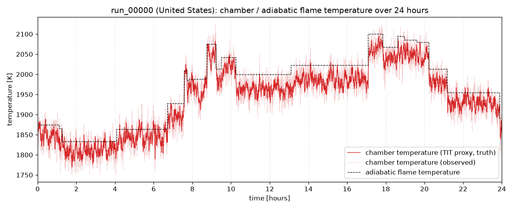
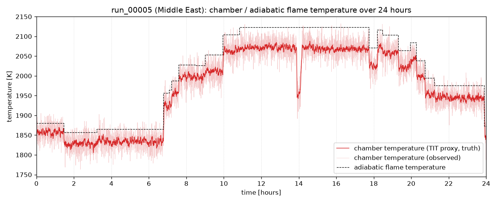
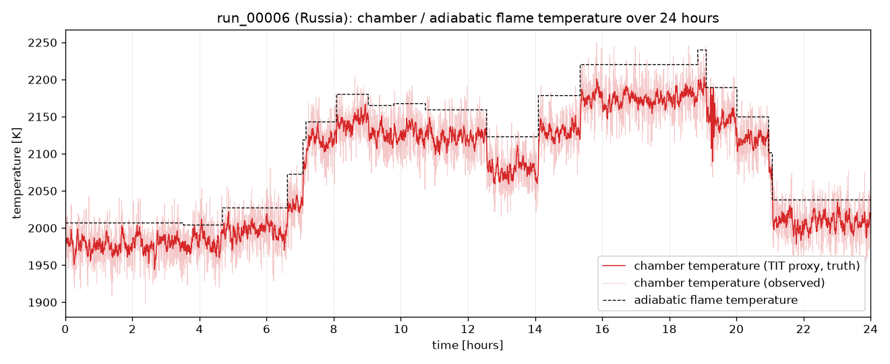
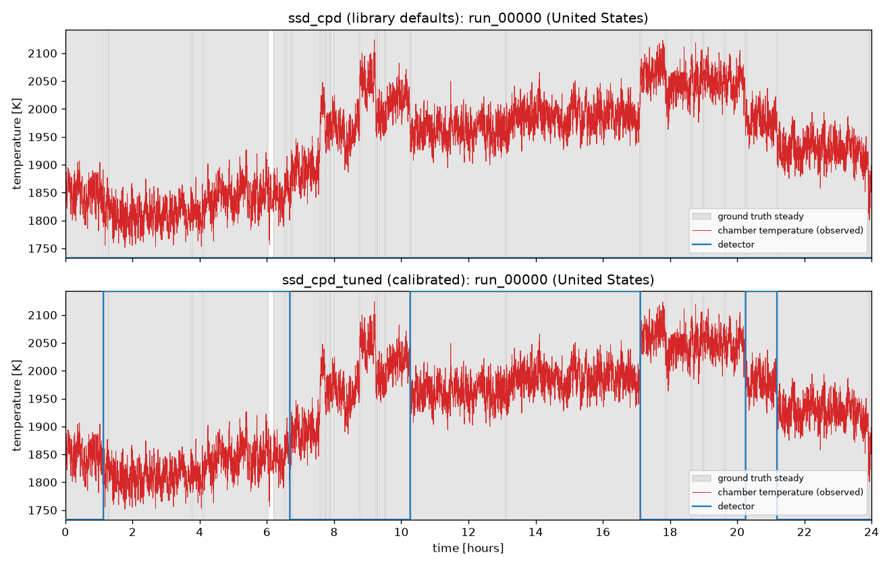
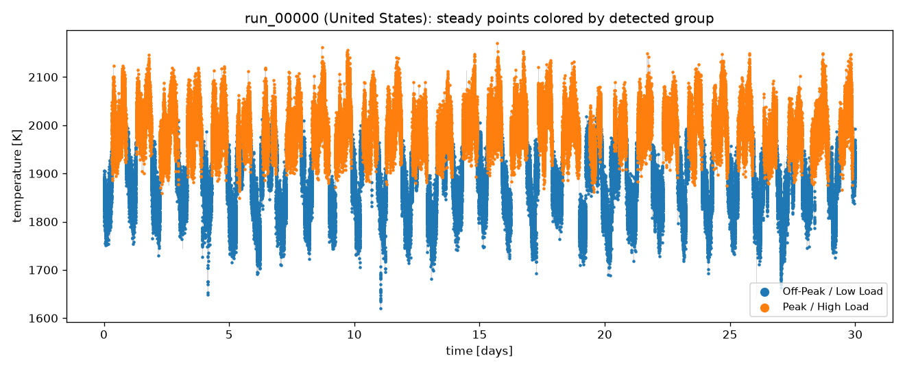
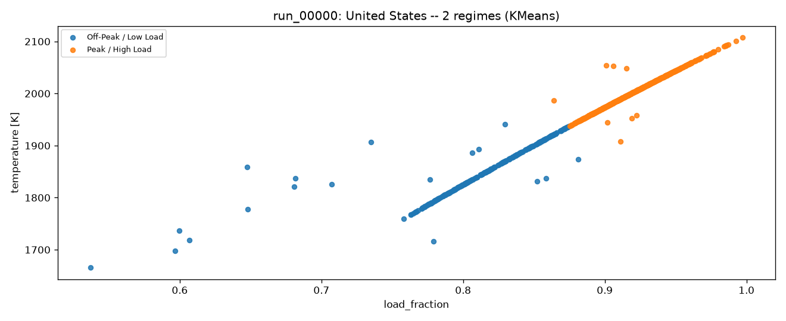
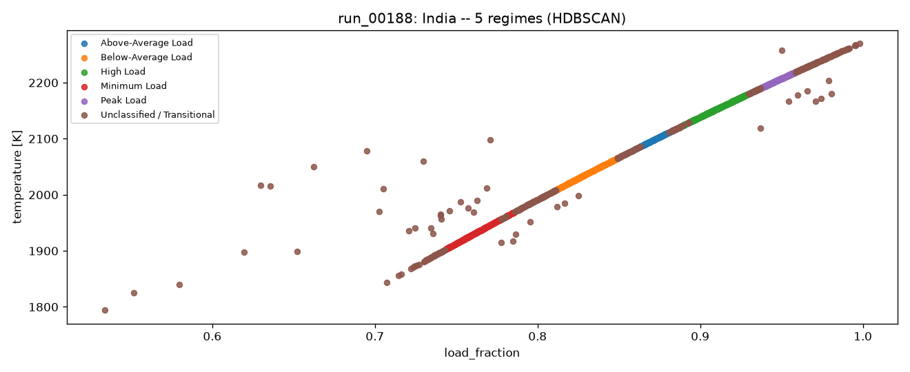

# SPECTRA

**S**teady **P**oint **E**xtraction and **C**lustering for **T**ransient **R**egime **A**nalysis

A framework for combustion time-series analysis: extracting steady-state
operating points from transient data and automatically grouping them.

## Phase 1: simulation

Before evaluating any extraction/clustering technique, we need labeled
transient-to-steady time-series data. `spectra` simulates a large gas
turbine's combustion chamber as a 0-D Cantera reactor network (GRI-Mech 3.0
chemistry, CH4/H2 fuel blends) over a **30-day period** at 15 s resolution,
following realistic grid electricity demand for one of 9 world regions
(United States, Canada, Central America, South America, Europe, Middle East,
Russia, China, India). On top of the demand-following dispatch, each run
carries the things that keep a real plant from ever sitting perfectly still:

- **Irregular dispatch**: the load target is re-dispatched every 15-60 min
  through the morning/evening demand ramps, every 1-4 h otherwise, with an
  8% chance of a 2-10 min real-time correction. That's ~580 setpoint
  changes per run, each ramped at a per-run rate of 2-6% of full load per
  minute with no overshoot.
- **Disturbances** (1-3 per day): *runbacks* (a fast 15-35% load cut, a
  short hold, then recovery), *fuel shifts* (a fuel heating-value drift
  that settles phi at a new level for 20-90 min), and *combustion dynamics*
  (a few minutes of phi oscillation, roughly the size of the sensor noise).
- **AGC wander**: continuous automatic-generation-control corrections, an
  Ornstein-Uhlenbeck process on load with a per-run amplitude (0.2-1.5% of
  full load) and correlation time (1-5 min). Some units barely regulate;
  others regulate hard.

Ambient temperature follows the region's diurnal/seasonal climate. Engine
design parameters (pressure ratio, reference mass flow, combustor volume,
fuel blend, site elevation) are Latin-hypercube sampled across runs.

**Ground truth.** A sample is labeled steady when the dispatch ramp has
finished, no disturbance transient is in progress, and the commanded
operating point has stayed inside a +/-0.5%-of-full-load band (and the
equivalent phi band) over the trailing 60 s. Stability is judged on the
signal's own recent history, so a detector can in principle recover it.

AGC excursions shorter than 2 minutes are counted as steady: an AGC move
only becomes a transient when it pushes the operating point out of the band
for at least 2 minutes. Without this rule, AGC noise crossing the band edge
produced ~20,000 transient blips of ~30 s per run, which no operator would
call a change of operating point. Dispatch ramps and disturbances are
always transient, however short. Across the 200 runs the steady fraction
ranges from 72% (units regulating hard) to 98%, median 97%.

Each run is written with both the ground truth and a noisy "observed" trace,
plus per-timestep `segment_id` / `is_steady` / `disturbance` labels to score
extraction methods against.

```bash
uv run spectra sweep --n-cases 200 --out datasets --workers 3 --fine-dt 15 --coarse-dt 15 --fine-window 0
```

Each run takes ~100 s and peaks at ~800 MB, so keep `--workers` within your
memory budget. Labels can be recomputed in place without re-running the
physics: `.venv/bin/python scripts/relabel_steady.py`.

Output: one directory per run, `datasets/<run_id>/`, containing:

- `data.parquet`: the time series (truth + noisy observed columns, plus
  per-timestep `segment_id` / `is_steady` / `disturbance` ground truth)
- `conditions.txt`: region, simulated date range, site/engine parameters,
  control-schedule setpoints, dispatch-interval and ramp statistics, AGC
  parameters, disturbance counts, and a daily summary table of ambient
  temperature / load / phi / adiabatic flame temperature over the 30 days
- `temperature.png`: chamber temperature (TIT proxy) vs. the equilibrium
  adiabatic flame temperature, over the full 30-day run
- `emissions.png`: NOx and CO (converted from tracked species mass
  fractions to molar ppm) over the full 30-day run

### Regional climate & demand profiles

Each run is assigned one of 9 world regions, which drives both its ambient
temperature cycle and its grid-demand shape (`src/sim/regions.py`,
`src/sim/demand.py`). What makes each region distinct:

| Region | Climate (summer / winter high) | Diurnal swing | Demand peak(s) | Diurnal shape | Peak:trough |
|---|---|---|---|---|---|
| United States | 31°C / -2°C | 9°C | Summer (Jul, +32%), secondary winter (Jan, +15%) | Double (morning+evening) | 1.7x |
| Canada | 27°C / -3.5°C | 9°C | Winter (Jan, +25%), secondary summer (Jul, +10%) | Double | 1.5x |
| Central America | 32°C / 30.5°C | 6°C | Mild dry-season uptick (Feb, +8%) | Double | 1.5x |
| South America | 29°C / 15°C | 8°C | Summer (Jan, +20%) + winter (Jul, +18%), hemisphere-inverted | Double | 1.6x |
| Europe | 25°C / 4.5°C | 8°C | Winter (Jan, +20%), secondary summer (Jul, +10%) | Double | 1.5x |
| Middle East | 43.5°C / 21.5°C | 13°C | Summer (Jul, +50%), most extreme | Single midday/AC | 1.9x |
| Russia | 23°C / -6.5°C | 8°C | Winter (Jan, +30%) only | Double (flatter) | 1.4x |
| China | 33°C / 2.5°C | 9°C | Summer (Jul, +25%) + winter (Jan, +15%), increasingly bimodal | Double | 1.6x |
| India | 41.5°C / 21°C | 10°C | Summer (May, +35%), dips in monsoon | Single midday/AC | 1.9x |

What actually differs between regions, physically:

- **Climate** (summer/winter means + diurnal swing) sets the compressor
  inlet temperature cycle, which directly moves adiabatic flame temperature
  and achievable firing temperature for a given fuel/air ratio.
- **Demand peak magnitude and month** sets how far above baseline the
  dispatched load climbs, and when within the 30-day window. Each run's
  start date is randomized, so different runs land on different parts of
  the regional seasonal curve.
- **Diurnal shape**: "double" (morning + evening peaks, trough overnight)
  vs. "single_midday" (one broad AC-driven plateau through the
  afternoon/evening). This changes the actual shape of the daily cycle in
  the TIT trace.
- **Peak:trough ratio** sets how deep the overnight minimum runs relative
  to the daily peak.

A full example run per region is included under `samples/<region>/`
(`conditions.txt`, `temperature.png`, `emissions.png`, and
`detection_before_after.png` from Phase 2; `data.parquet` omitted,
~30MB/run). The sample plots show the first 24 hours of each run, the same
window Phase 2 evaluates on; `conditions.txt` still covers all 30 days.
Three contrasting examples:

**United States**: double-peak, summer-dominant, moderate swing


**Middle East**: single-peak (AC-driven), one broad daily plateau and the
largest peak:trough ratio in the table (1.9x)


**Russia**: double-peak, with the lowest peak:trough ratio in the table
(1.4x), so a shallower daily swing than the AC-driven regions, since winter
heating demand persists through the night


The remaining 6 regions (Canada, Central America, South America, Europe,
China, India) follow the same pattern and are available under their own
`samples/<region>/` directory.

## Phase 2: steady-window detection (indsl)

Goal: reliably detect a continuous **>=60-second steady window** in the
noisy "observed" trace. Ground truth for this is derived from the
simulator's per-sample `is_steady` label via a rolling 60s AND (`src/eval/labels.py`):
a point only counts as a valid steady window if every sample in the
preceding 60 seconds was also steady.

**Evaluation window: one day.** Every detector is scored on the first 24
hours of each run (5,760 samples per channel at 15 s). One day already holds
the full daily cycle: the overnight trough, the morning and evening demand
ramps, ~14 re-dispatches, 1-3 disturbances, and continuous AGC. All 8
univariate detectors in [indsl.detect](https://indsl.docs.cognite.com/detect.html),
plus calibrated variants of `ssd_cpd` and `cusum` and an `always_steady`
baseline, were run against 4 channels (chamber temperature, pressure, air
mass flow, phi) on 195 runs: every run except the 5 calibration runs, which
gives 21-23 runs for each of the 9 regions (`src/eval/methods.py`,
`run_eval.py`). In this window, 93.5% of samples are inside a true 60 s
steady window.

**Metric.** The headline metric is MCC (Matthews correlation coefficient):
1 is perfect, 0 is no better than chance, and any constant predictor
("always steady" or "never steady") scores exactly 0. F1 on the steady class
can't be the headline. At a 93.5% base rate, `always_steady` scores
F1 = 0.965 without detecting anything, and an F1-tuned detector simply
converges on that trivial answer.

**Calibration** (`src/eval/calibrate.py`): `ssd_cpd` (per channel) and
`cusum` (one global setting, scaled to each series' noise floor) were
grid-searched by MCC on the first day of 5 held-out runs, distinct from the
evaluation runs. ED-Pelt cuts a shorter series into more segments, so the
best `ssd_cpd` thresholds depend on the input length: `methods.py` keeps a
one-day set and a 4-day set and uses whichever was calibrated on the length
closest to its input. `cusum` lands on the same setting at both lengths
(drift 2x and threshold 12x the noise floor).

**Input averaging.** indsl resamples the input of `ssd_cpd` and
`cpd_ed_pelt` to >=60 s spacing by keeping every 4th sample at 15 s, which
throws samples away without averaging any noise out. Both are fed 60 s block
means instead, with `min_distance` counted in those 60 s samples.

**Results** (mean MCC over 195 runs; overall MCC is the mean over all four
channels):

| Method | temperature | mass flow | phi | pressure | overall MCC | balanced acc. | F1 | called steady |
|---|---|---|---|---|---|---|---|---|
| `cpd_ed_pelt` | **0.291** | 0.287 | **0.298** | 0.000 | **0.219** | 0.552 | **0.967** | 99.2% |
| `cusum_tuned` | 0.168 | **0.294** | 0.125 | 0.000 | 0.147 | **0.573** | 0.903 | 88.3% |
| `ssid` | 0.180 | 0.271 | 0.015 | 0.000 | 0.117 | 0.543 | 0.782 | 77.1% |
| `ssd_cpd_tuned` | 0.081 | 0.107 | 0.109 | -0.004 | 0.073 | 0.546 | 0.877 | 83.8% |
| `vma` | 0.045 | 0.064 | 0.079 | 0.000 | 0.047 | 0.554 | 0.561 | 39.4% |
| `ssd_cpd` (defaults) | 0.005 | 0.000 | 0.010 | -0.004 | 0.003 | 0.503 | 0.251 | 23.5% |
| `unchanged_signal_detector` | 0.000 | 0.000 | 0.002 | 0.000 | 0.001 | 0.500 | 0.001 | 0.0% |
| `cusum` (defaults) | 0.000 | 0.000 | 0.000 | 0.000 | 0.000 | 0.500 | 0.000 | 0.0% |
| `drift` | 0.000 | 0.000 | 0.000 | 0.000 | 0.000 | 0.500 | 0.965 | 100% |
| `oscillation_detector` | 0.000 | 0.000 | 0.000 | 0.000 | 0.000 | 0.500 | 0.965 | 100% |
| `always_steady` (baseline) | 0.000 | 0.000 | 0.000 | 0.000 | 0.000 | 0.500 | 0.965 | 100% |

**By region** (mean MCC over temperature, mass flow and phi):

| Region | Runs | Truly steady | `cpd_ed_pelt` | `cusum_tuned` | `ssid` | `ssd_cpd_tuned` |
|---|---|---|---|---|---|---|
| United States | 23 | 92.7% | 0.281 | 0.208 | 0.162 | 0.119 |
| Canada | 22 | 94.6% | 0.301 | 0.201 | 0.158 | 0.097 |
| Central America | 21 | 94.1% | 0.316 | 0.178 | 0.149 | 0.081 |
| South America | 22 | 92.1% | 0.293 | 0.233 | 0.187 | 0.118 |
| Europe | 22 | 93.7% | 0.301 | 0.174 | 0.145 | 0.099 |
| Middle East | 21 | 94.0% | 0.281 | 0.213 | 0.160 | 0.103 |
| Russia | 21 | 94.8% | 0.311 | 0.183 | 0.142 | 0.102 |
| China | 21 | 91.2% | 0.282 | 0.179 | 0.149 | 0.080 |
| India | 22 | 94.1% | 0.262 | 0.189 | 0.148 | 0.092 |

**Findings:**

- **No detector reliably detects steady windows on this data.** The best
  overall MCC is 0.22 (`cpd_ed_pelt`) and no balanced accuracy exceeds
  0.573. The best single run/channel result is MCC 0.55 (`cusum_tuned` on
  the mass flow of `run_00120`, South America). `cpd_ed_pelt` edges
  `always_steady` on F1 by 0.002, because it calls 99.2% of samples steady.
- **The detectors resolve hours while the transients last minutes.** On one
  day of chamber temperature, ED-Pelt finds a median of 13.5 change points,
  so its segments run a median 85 min (p10 20 min). The ground truth has a
  median of 24 transient gaps per day, with a median length of 2 min, and
  96% of them last 5 min or less. `ssd_cpd` and `cpd_ed_pelt` classify whole
  segments, so a 2-minute AGC transient inside an 85-minute segment barely
  moves that segment's statistics. Their MCC comes from the large dispatch
  ramps and disturbances, which do produce change points.
- **One day scores the same as a full month.** On the 40-run evaluation set,
  the full 30-day runs put the best method per channel within 0.05 MCC of
  the one-day scores above. The exception is `ssd_cpd_tuned`: on 30 days it
  calls 99.7% of samples steady, while its one-day thresholds bring that down
  to 84%. It then switches whole multi-hour blocks whose edges miss the true
  gaps (figure below), which is why its MCC stays at 0.07-0.11.
- **Region makes no difference.** `cpd_ed_pelt` scores 0.26-0.32 in every
  region and `cusum_tuned` 0.17-0.23. Detection difficulty is set by the AGC
  amplitude and sensor noise, which are sampled independently of region.
- **Several methods degenerate to a constant.** `drift` and
  `oscillation_detector` never fire. `cusum` with library defaults and
  `unchanged_signal_detector` flag everything as transient (the default
  `cusum` drift term goes deeply negative on absolute-scale signals like
  Kelvin or Pascal).
- **Pressure is uninformative for every method** (MCC ~0). Chamber pressure
  is held near its target by the controller, so it carries little
  operating-point information. On full 30-day runs, `ssd_cpd`,
  `ssd_cpd_tuned` and `cpd_ed_pelt` are skipped on pressure, where ED-Pelt
  hits its O(n^2) worst case (~2 min per call); on one day that case is
  cheap and every method runs.

**Earlier result, superseded.** On the first, idealized dataset (fixed
4-hour dispatch, perfectly flat holds, 94.5% steady), tuned `ssd_cpd` and
`cusum` scored F1 0.968 and 0.947. Those numbers came from long flat
plateaus that any detector could find, and from F1 rewarding near-constant
"steady" predictions. They don't carry over to the realistic data.

`ssd_cpd` on the first day of `run_00000`'s temperature channel, library
defaults vs. tuned, against the ground-truth steady regions (shaded gray):



The defaults (top) never call anything steady. The tuned version (bottom)
switches between blocks of several hours, while the ground truth's
transient gaps (the thin white lines) last a few minutes each. The same
plot for every other region's sample run is in
`samples/<region>/detection_before_after.png`.

```bash
# calibration on the first day: one process per (method, channel), each writes calib_<method>_<channel>_1d.json
.venv/bin/python -m src.eval.calibrate ssd_cpd temperature 1
.venv/bin/python -m src.eval.calibrate cusum temperature 1

# one-day evaluation of every non-calibration run (~10 min on 3 workers), writes eval_results_all_1d.parquet
.venv/bin/python -m src.eval.run_eval --days 1 --runs all --workers 3

# regenerate everything under samples/ (grouping example runs as args)
.venv/bin/python scripts/make_sample_figures.py run_00000 run_00188:hdbscan
```

## Phase 3: automatic grouping of steady points

Goal: given the extracted steady windows, automatically group similar
operating points into named regimes. Grouping uses the full 30 days of each
run, since a single day holds only ~20 steady points.

- **Extraction** (`src/cluster/extract.py`): each contiguous stretch the
  ground truth marks steady for >=60 s becomes one steady point, summarized
  by its mean temperature, pressure, air/fuel mass flow, phi, load_fraction,
  NOx, and CO over that dwell. Stretches split on every transient, so one
  dispatch segment can yield several points (before a fuel shift, on its
  plateau, after it). That gives a median of 674 points per run (589-3,604),
  181,530 in total across 200 runs, with a median dwell of 28 min (p10
  4 min, p90 2 h).
- **Clustering** (`src/cluster/cluster.py`): HDBSCAN (picks cluster count
  automatically and flags ambiguous points as noise) cross-checked against KMeans with *k* chosen by
  silhouette score, run independently per engine/run.
- **Naming** (`src/cluster/naming.py`): clusters are ranked by mean
  `load_fraction` and mapped onto an ordered vocabulary (Minimum / Low /
  Below-Average / Mid / Above-Average / High / Near-Peak / Peak Load), so
  names stay consistent whether a run resolves into 2 or 8 regimes.

**Findings**:

- **KMeans settles on k=2 for 194 of 200 runs** (k=3 for 3 runs, k=4, 5
  and 7 for one each; silhouette 0.54-0.65, median 0.59, with no regional
  difference): an off-peak band and a peak band. The steady points fill the
  load range almost continuously, and on a continuous 1-D spread silhouette
  prefers a single split.
- **HDBSCAN** finds 2 regimes in 135 runs, 3 in 52, 4 in 9 and 5 in 4,
  flagging a median 19% of points (14-33%, p10-p90) as noise.
- **The v1 regional pattern did not survive.** On the earlier idealized
  data (180 perfectly flat plateaus per run, sitting at a few discrete
  demand levels), single-peak regions resolved to 2 clusters and
  double-peak regions to 3. That separation came from how few, and how
  clean, v1's plateaus were; on the realistic data every region looks the
  same to KMeans.
- **Disturbances add real off-axis structure.** Every steady point used to
  sit on one load/temperature curve, since within a run everything was a
  function of one demand signal. Fuel-shift and runback plateaus now sit
  off that curve (same load, different phi and temperature), and HDBSCAN
  correctly leaves them out of the load bands (example below).

### Example groupings

The groups shown directly on the temperature trace they were extracted
from (`run_00000`, United States):



**run_00000 (United States, KMeans k=2, silhouette=0.62, 802 steady points)**

| Group | Points | Temp [K] | Load Fraction | Phi | NOx [ppm] | CO [ppm] |
|---|---|---|---|---|---|---|
| Off-Peak / Low Load | 277 | 1853 | 0.81 | 0.57 | 11.8 | 449 |
| Peak / High Load | 525 | 2003 | 0.92 | 0.65 | 47.2 | 553 |



**run_00188 (India, HDBSCAN, 5 regimes, silhouette=0.23, 1,542 steady points)**

| Group | Points | Temp [K] | Load Fraction | Phi | NOx [ppm] | CO [ppm] |
|---|---|---|---|---|---|---|
| Minimum Load | 225 | 1932 | 0.76 | 0.53 | 29.6 | 152 |
| Below-Average Load | 199 | 2037 | 0.83 | 0.59 | 104.3 | 192 |
| Unclassified / Transitional | 494 | 2088 | 0.86 | 0.62 | 359.6 | 335 |
| Above-Average Load | 109 | 2099 | 0.87 | 0.63 | 209.0 | 251 |
| High Load | 326 | 2154 | 0.91 | 0.66 | 384.0 | 348 |
| Peak Load | 189 | 2205 | 0.95 | 0.70 | 636.6 | 487 |



The points above and below the main line are fuel-shift and runback
plateaus. HDBSCAN puts them in "Unclassified / Transitional", together with
the sparser stretches of the curve between the five bands, which keeps each
load band to points that share its operating point. The off-curve points
are also why that group's mean NOx and CO sit above the bands either side
of it.

```bash
.venv/bin/python -c "
from src.cluster.run_cluster import cluster_sweep
summary, points = cluster_sweep('datasets')
summary.to_parquet('cluster_summary.parquet', index=False)
points.to_parquet('cluster_points.parquet', index=False)
"
```

## Modeling assumptions

This is a simplified engineering model built for generating realistic
*shapes* of transient/steady behavior, not a validated performance or
emissions prediction tool. Key simplifications:

**Combustor physics**
- The chamber is a single 0-D well-stirred reactor (`IdealGasReactor`), not
  a 3-D CFD flame or a multi-stage/multi-can combustor. It represents one
  can/basket of a can-annular or annular combustor, not the full engine.
- Chemistry is GRI-Mech 3.0 (53 species), developed for natural-gas
  combustion; it also covers H2 chemistry, used here as a simplified proxy
  for CH4/H2-blended fuel. It is not a surrogate mechanism for heavier
  liquid fuels.
- The combustor starts pre-ignited: it's initialized at the full chemical
  equilibrium of the run's starting setpoint, skipping cold-start ignition
  transients (which are out of scope; this project cares about
  steady/transient *operating-point* behavior, not ignition dynamics). This
  does leave a brief, non-physical first-sample artifact in trace species
  (NO/CO) that the emissions plot deliberately excludes from its axis scale.
- Compressor discharge conditions use a simple isentropic-compression +
  fixed isentropic-efficiency relation, not a real compressor map; inlet
  pressure loss, bleed, and IGV effects are not modeled.
- Chamber pressure is held near target via a `PressureController` against a
  fixed-pressure exhaust reservoir, approximating constant turbine
  nozzle/backpressure conditions downstream.
- Site/ambient pressure (elevation) is fixed per run; only ambient
  *temperature* varies over the 30 days.
- The reactor is solved **quasi-steadily**: at each 15 s sample the inputs
  are held fixed and the reactor network is solved directly for its steady
  state (`ReactorNet.solve_steady`, seeded from the previous sample). The
  combustor's residence time is 3-70 ms, roughly 1000x shorter than the
  sample interval, so the chamber is always fully settled to its current
  inputs at this resolution. This matches continuous time integration to
  0.012 K (p99) and is ~19x faster, which is what makes 30 days of
  continuously moving AGC forcing tractable (~100 s/run, down from ~24 min).
  The trade-off is that dynamics faster than a few residence times are not
  represented, which is fine for operating-point analysis at 15 s.

**Dispatch / control schedule**
- Equivalence ratio and load both scale linearly with a single normalized
  "demand" signal between a sampled turndown point and a sampled full-load
  point. Real multi-variable combustion control (staging, pilot/main
  splits, IGV schedules) is not modeled.
- Setpoint changes are ramp-rate limited (2-6% of full load per minute,
  sampled per run) with no overshoot, consistent with how real heavy-duty
  turbine control systems actively avoid firing-temperature overshoot (see
  Resources). Re-dispatch timing is irregular but drawn from fixed
  distributions (denser through the morning/evening ramp hours), not from a
  market model. Fast cold-start/ignition transients are excluded by design
  (see above).
- AGC is modeled as an Ornstein-Uhlenbeck process on load, with phi moving
  alongside it through the same load-to-phi mapping the dispatch uses. Real
  regulation signals (e.g. PJM RegA/RegD) have their own spectra; this only
  captures their mean-reverting, minutes-correlated character.
- Disturbances are setpoint-level perturbations, not physical faults: a
  runback is a commanded load/fuel cut, a fuel shift is an effective phi
  offset (the fuel composition itself doesn't change), and combustion
  dynamics is an imposed phi oscillation, not an acoustic instability.
  Ambient steps (weather fronts) aren't modeled, since their effect on flame
  temperature sits below the sensor noise.
- A run's seasonal baseline (the climatological "which month is it")
  is fixed at that run's start date; only the diurnal and weekday/weekend
  components evolve across the 30 simulated days, since a calendar month's
  climatological mean does not meaningfully drift over just 30 days; that's
  a year-timescale effect, not a within-month one.
- Grid demand seasonality, diurnal shape, and weekday/weekend variation are
  hand-parameterized per region from the directional magnitudes in the
  Resources below, not fit to measured load data.

**Emissions**
- NOx (NO+NO2) and CO are read directly from the kinetic simulation's
  species mass fractions and converted to molar ppm (wet, uncorrected; no
  dry-basis or 15%-O2 correction is applied). A single 0-D WSR tends to
  over-predict both relative to a real staged/lean-premix combustor, so
  treat these as relative trends across the sweep, not compliance-grade
  figures.

**Sensors**
- The "observed" trace adds Gaussian measurement noise (default 40 dB SNR)
  to temperature/pressure/mass-flow; optional sensor lag and dropout are
  supported but off by default.

## Resources

Assumptions about grid demand seasonality/shape and turbine startup/loading
behavior were informed by:

- [EIA, Electricity Load Shapes handbook](https://www.eia.gov/analysis/handbook/pdf/Handbook%20Section%20B3_Electricity%20Load%20Shapes.pdf)
- [EIA, Today in Energy, id=10211](https://www.eia.gov/todayinenergy/detail.php?id=10211)
- [EIA, Today in Energy, id=46117](https://www.eia.gov/todayinenergy/detail.php?id=46117)
- [EIA, Today in Energy, id=29112](https://www.eia.gov/todayinenergy/detail.php?id=29112)
- [ENTSO-E, Winter/Summer Outlook reports](https://eepublicdownloads.entsoe.eu)
- [ISO New England, System Load Graph](https://isonewswire.com/2025/06/16/system-load-graph-tracks-ebb-and-flow-of-daily-electricity-use/)
- [Green Building Advisor, duck-curve explainer](https://www.greenbuildingadvisor.com/article/an-introduction-to-the-duck-curve)
- [ORF, Energy News Monitor (Indian peak demand)](https://www.orfonline.org/research/energy-news-monitor-volume-xxii-issue-39)
- [Powerline, Demand Uptick: Key Drivers (Indian peak demand)](https://powerline.net.in/2026/07/03/demand-uptick-key-drivers-and-initiatives-to-meet-the-growing-power-requirement/)
- [Combined Cycle Journal, Turbine Tip No. 7 (startup sequencing)](https://ccj-online.com/?p=12204)
- [control.com forum, Frame 9E.03 time from barring to sync](https://control.com/forums/threads/51486)
- [control.com forum, fast load rate](https://control.com/forums/threads/fast-load-rate.47614/post-47614)
- [control.com forum, gas turbine ramp load capacity](https://control.com/forums/threads/gas-turbine-ramp-load-capacity.50333/)
- [control.com forum, start-up sequence of GT Frame 9](https://control.com/forums/threads/start-up-sequence-of-gt-frame-9.48018/post-48018)
- [US Patent 11,255,218, Method for starting up a gas turbine engine of a combined cycle power plant](https://patents.google.com/patent/US11255218B2)
- [US Patent 4,010,605, Fixed time acceleration gas turbine startup speed control](https://patents.google.com/patent/US4010605A)
- [US Patent 5,732,546, Transient turbine overtemperature control](https://patents.google.com/patent/US5732546A)

Combustion chemistry:

- [Cantera](https://cantera.org)
- [G. P. Smith et al., GRI-Mech 3.0](http://www.me.berkeley.edu/gri_mech/)

Detection and clustering:

- [indsl.detect](https://indsl.docs.cognite.com/detect.html)
- [scikit-learn](https://scikit-learn.org)
