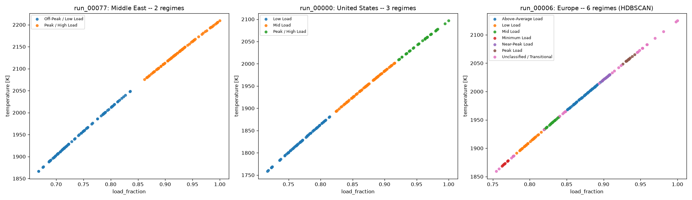

# SPECTRA

**S**teady **P**oint **E**xtraction and **C**lustering for **T**ransient **R**egime **A**nalysis

A framework for combustion time-series analysis: extracting steady-state
operating points from transient data and automatically grouping them.

## Phase 1: simulation

Before evaluating any extraction/clustering technique, we need labeled
transient-to-steady time-series data. `spectra` simulates a large gas
turbine's combustion chamber as a 0-D Cantera reactor network (GRI-Mech 3.0
chemistry, CH4/H2 fuel blends) over a **30-day period**, with the dispatched
setpoint (equivalence ratio / load) tracking realistic grid electricity
demand for one of 9 world regions (United States, Canada, Central America,
South America, Europe, Middle East, Russia, China, India); demand is
re-evaluated every 4 hours from that region's seasonal + diurnal +
weekday/weekend pattern, with realistic ramps (minutes, no overshoot) between
levels. Ambient temperature follows the same region's diurnal/seasonal
climate. Engine design parameters (pressure ratio, reference mass flow,
combustor volume, fuel blend, site elevation) are Latin-hypercube sampled
across runs.

Each run is written with both the ground truth and a noisy "observed" trace,
plus per-timestep `segment_id` / `is_steady` labels to score extraction
methods against.

```bash
uv run spectra sweep --n-cases 200 --out datasets --workers 8
```

Output: one directory per run, `datasets/<run_id>/`, containing:

- `data.parquet`: the time series (truth + noisy observed columns, plus
  per-timestep `segment_id` / `is_steady` ground truth)
- `conditions.txt`: region, simulated date range, site/engine parameters,
  control-schedule setpoints, and a daily summary table of ambient
  temperature / load / phi / adiabatic flame temperature over the 30 days
- `temperature.png`: chamber temperature (TIT proxy) vs. the equilibrium
  adiabatic flame temperature, over the full 30-day run
- `emissions.png`: NOx and CO (converted from tracked species mass
  fractions to molar ppm) over the full 30-day run

### Regional climate & demand profiles

Each run is assigned one of 9 world regions, which drives both its ambient
temperature cycle and its grid-demand shape (`src/sim/regions.py`,
`src/sim/demand.py`). What makes each region distinct:

| Region | Climate (summer / winter high) | Diurnal swing | Demand peak(s) | Diurnal shape | Peak:trough |
|---|---|---|---|---|---|
| United States | 31°C / -2°C | 9°C | Summer (Jul, +32%), secondary winter (Jan, +15%) | Double (morning+evening) | 1.7x |
| Canada | 27°C / -3.5°C | 9°C | Winter (Jan, +25%), secondary summer (Jul, +10%) | Double | 1.5x |
| Central America | 32°C / 30.5°C | 6°C | Mild dry-season uptick (Feb, +8%) | Double | 1.5x |
| South America | 29°C / 15°C | 8°C | Summer (Jan, +20%) + winter (Jul, +18%), hemisphere-inverted | Double | 1.6x |
| Europe | 25°C / 4.5°C | 8°C | Winter (Jan, +20%), secondary summer (Jul, +10%) | Double | 1.5x |
| Middle East | 43.5°C / 21.5°C | 13°C | Summer (Jul, +50%), most extreme | Single midday/AC | 1.9x |
| Russia | 23°C / -6.5°C | 8°C | Winter (Jan, +30%) only | Double (flatter) | 1.4x |
| China | 33°C / 2.5°C | 9°C | Summer (Jul, +25%) + winter (Jan, +15%), increasingly bimodal | Double | 1.6x |
| India | 41.5°C / 21°C | 10°C | Summer (May, +35%), dips in monsoon | Single midday/AC | 1.9x |

What actually differs between regions, physically:

- **Climate** (summer/winter means + diurnal swing) sets the compressor
  inlet temperature cycle, which directly moves adiabatic flame temperature
  and achievable firing temperature for a given fuel/air ratio.
- **Demand peak magnitude and month** sets how far above baseline the
  dispatched load climbs, and when within the 30-day window. Each run's
  start date is randomized, so different runs land on different parts of
  the regional seasonal curve.
- **Diurnal shape**: "double" (morning + evening peaks, trough overnight)
  vs. "single_midday" (one broad AC-driven plateau through the
  afternoon/evening). This changes the actual shape of the daily cycle in
  the TIT trace.
- **Peak:trough ratio** sets how deep the overnight minimum runs relative
  to the daily peak.

A full example run per region is included under `samples/<region>/`
(`conditions.txt`, `temperature.png`, `emissions.png`; `data.parquet`
omitted, ~10MB/run). Three contrasting examples:

**United States**: double-peak, summer-dominant, moderate swing


**Middle East**: single-peak (AC-driven), the most extreme seasonal/diurnal swing of any region


**Russia**: double-peak, with the flattest overnight troughs of any region
(peak:trough 1.4x, lowest in the table), since winter heating demand
persists through the night instead of dropping off like AC-driven load does


The remaining 6 regions (Canada, Central America, South America, Europe,
China, India) follow the same pattern and are available under their own
`samples/<region>/` directory.

## Phase 2: steady-window detection (indsl)

Goal: reliably detect a continuous **>=60-second steady window** in the
noisy "observed" trace. Ground truth for this is derived from the
simulator's per-sample `is_steady` label via a rolling 60s AND (`src/eval/labels.py`):
a point only counts as a valid steady window if every sample in the
preceding 60 seconds was also steady.

All 8 univariate detectors in [indsl.detect](https://indsl.docs.cognite.com/detect.html)
were run against 4 channels (chamber temperature, pressure, air mass flow,
phi) across a 40-run held-out sample (`src/eval/methods.py`, `run_eval.py`):

- **4 of 8 were uninformative out of the box**: `drift` and
  `oscillation_detector` predicted "steady" 100% of the time (never fired),
  `cpd_ed_pelt` predicted "steady" 99.7% of the time, `cusum` predicted
  "steady" 0% of the time (its default `drift` formula goes deeply negative
  on absolute-scale signals like Kelvin/Pascal, so it fires constantly).
  Their aggregate precision (~0.94-0.95) just matched the dataset's 94.5%
  steady base rate, which is not genuine skill.
- `ssid` looked good in a blended aggregate (F1=0.73) but that masked two
  different degenerate failure modes across channels, not real
  discrimination.
- `unchanged_signal_detector` only works on the noise-free commanded `phi`
  signal (precision 0.996) and is actively worse than random on real noisy
  sensor channels (precision 0.000); it assumes exact repeated values,
  which essentially never happens with Gaussian sensor noise.
- `ssd_cpd` and `cusum`, with **library defaults**, showed real but
  channel-dependent signal (F1 0.13-0.94), tanked by two implementation
  quirks: `ssd_cpd`'s variance term divides by *segment length* rather than
  noise level, and `cusum`'s default drift formula assumes near-zero-mean
  data.

**Tuning pass** (`src/eval/calibrate.py`): grid search against a held-out
5-run calibration slice (distinct from the 40-run eval set), scored against
a diff-based noise-floor estimate rather than guessed:

| Method | F1 before | F1 after tuning |
|---|---|---|
| `ssd_cpd` | 0.533 | **0.968** |
| `cusum` | 0.000 | **0.947** |

Both generalized cleanly: tuned on the 5-run calibration slice, then scored
on the separate 40-run evaluation set, holding up consistently across all 4
channels and all 9 regions.
**Conclusion: classical detection, properly tuned to the data's actual
scale/noise/timescale, solves the stated task well (`ssd_cpd_tuned`
F1~=0.97, near-instant detection).**

```bash
.venv/bin/python -c "
from src.eval.run_eval import evaluate_sweep
df = evaluate_sweep('datasets', run_ids=[f'run_{i:05d}' for i in range(0, 200, 5)], workers=3)
df.to_parquet('eval_results.parquet', index=False)
"
```

## Phase 3: automatic grouping of steady points

Goal: given the extracted steady windows, automatically group similar
operating points into named regimes.

- **Extraction** (`src/cluster/extract.py`): each contiguous dispatch
  segment the simulator marks steady (>=60s) becomes one steady point,
  summarized by its mean temperature, pressure, air/fuel mass flow, phi,
  load_fraction, NOx, and CO over that dwell (~180 points/run, 36,000 total
  across 200 runs).
- **Clustering** (`src/cluster/cluster.py`): HDBSCAN (picks cluster count
  automatically, flags ambiguous points as noise rather than forcing them
  into a cluster) cross-checked against KMeans with *k* chosen by
  silhouette score, run independently per engine/run.
- **Naming** (`src/cluster/naming.py`): clusters are ranked by mean
  `load_fraction` and mapped onto an ordered vocabulary (Minimum / Low /
  Below-Average / Mid / Above-Average / High / Near-Peak / Peak Load), so
  names stay consistent whether a run resolves into 2 or 8 regimes.

**Findings**: clustering automatically rediscovers physically meaningful
load regimes per engine (e.g. Low/Mid/Peak Load bands with distinct
NOx/CO signatures) purely from steady-state data. Cluster count tracks each
region's demand shape exactly as designed in Phase 1: single-peak regions
(India, Middle East) consistently resolve to **2 clean clusters**
(silhouette ~=0.72); double-peak regions (China, Europe, United States) need
**3-3.4 clusters** (silhouette ~=0.60).

### Example groupings

**run_00077 (Middle East, k=2, silhouette=0.71)**

| Group | Points | Temp [K] | Load Fraction | Phi | NOx [ppm] | CO [ppm] |
|---|---|---|---|---|---|---|
| Off-Peak / Low Load | 90 | 1949 | 0.74 | 0.58 | 20.6 | 560 |
| Peak / High Load | 90 | 2136 | 0.92 | 0.70 | 108.9 | 888 |

**run_00000 (United States, k=3, silhouette=0.63)**

| Group | Points | Temp [K] | Load Fraction | Phi | NOx [ppm] | CO [ppm] |
|---|---|---|---|---|---|---|
| Low Load | 68 | 1826 | 0.77 | 0.55 | 8.6 | 432 |
| Mid Load | 80 | 1950 | 0.87 | 0.62 | 27.2 | 485 |
| Peak / High Load | 32 | 2049 | 0.96 | 0.68 | 71.3 | 632 |

**run_00006 (Europe, HDBSCAN, 6 regimes, silhouette=0.38)**

| Group | Points | Temp [K] | Load Fraction | Phi | NOx [ppm] | CO [ppm] |
|---|---|---|---|---|---|---|
| Minimum Load | 9 | 1875 | 0.77 | 0.55 | 11.7 | 229 |
| Low Load | 32 | 1908 | 0.80 | 0.57 | 16.9 | 231 |
| Mid Load | 22 | 1944 | 0.83 | 0.59 | 25.1 | 237 |
| Above-Average Load | 56 | 1992 | 0.87 | 0.62 | 43.2 | 257 |
| Unclassified / Transitional | 28 | 2012 | 0.89 | 0.63 | 74.5 | 296 |
| Near-Peak Load | 21 | 2025 | 0.90 | 0.64 | 61.7 | 278 |
| Peak Load | 12 | 2057 | 0.93 | 0.66 | 87.7 | 309 |



The single-peak region needs only 2 groups to cleanly separate its steady
points; the double-peak United States region needs 3; Europe's run here
resolves to 6 via HDBSCAN, with 28 points flagged as "Unclassified /
Transitional" rather than forced into a regime they don't cleanly belong
to. More regimes generally emerge from runs with larger or noisier demand
swings, where the continuum of load levels splits into finer bands.

**Caveat**: within a single run, engine design is fixed and phi / load /
temperature / pressure / mass flow are all deterministic functions of one
demand signal, so they're nearly perfectly collinear (correlation
~=0.99-1.00, confirmed empirically). This clustering is therefore mostly
finding good breakpoints along a 1-D ordered continuum, auto-selecting
sensible regime boundaries/counts rather than discovering independent
multi-dimensional structure. Clustering *across* runs (different
engines/regions/fuel blends) would expose richer, genuinely
multi-dimensional structure; this project clusters within a run by design
choice.

```bash
.venv/bin/python -c "
from src.cluster.run_cluster import cluster_sweep
summary, points = cluster_sweep('datasets')
summary.to_parquet('cluster_summary.parquet', index=False)
points.to_parquet('cluster_points.parquet', index=False)
"
```

## Modeling assumptions

This is a simplified engineering model built for generating realistic
*shapes* of transient/steady behavior, not a validated performance or
emissions prediction tool. Key simplifications:

**Combustor physics**
- The chamber is a single 0-D well-stirred reactor (`IdealGasReactor`), not
  a 3-D CFD flame or a multi-stage/multi-can combustor. It represents one
  can/basket of a can-annular or annular combustor, not the full engine.
- Chemistry is GRI-Mech 3.0 (53 species), developed for natural-gas
  combustion; it also covers H2 chemistry, used here as a simplified proxy
  for CH4/H2-blended fuel. It is not a surrogate mechanism for heavier
  liquid fuels.
- The combustor starts pre-ignited: it's initialized at the full chemical
  equilibrium of the run's starting setpoint, skipping cold-start ignition
  transients (which are out of scope; this project cares about
  steady/transient *operating-point* behavior, not ignition dynamics). This
  does leave a brief, non-physical first-sample artifact in trace species
  (NO/CO) that the emissions plot deliberately excludes from its axis scale.
- Compressor discharge conditions use a simple isentropic-compression +
  fixed isentropic-efficiency relation, not a real compressor map; inlet
  pressure loss, bleed, and IGV effects are not modeled.
- Chamber pressure is held near target via a `PressureController` against a
  fixed-pressure exhaust reservoir, approximating constant turbine
  nozzle/backpressure conditions downstream.
- Site/ambient pressure (elevation) is fixed per run; only ambient
  *temperature* varies over the 30 days.

**Dispatch / control schedule**
- Equivalence ratio and load both scale linearly with a single normalized
  "demand" signal between a sampled turndown point and a sampled full-load
  point. Real multi-variable combustion control (staging, pilot/main
  splits, IGV schedules) is not modeled.
- Setpoint changes ramp over minutes without overshoot, consistent with how
  real heavy-duty turbine control systems actively avoid firing-temperature
  overshoot (see Resources). Fast cold-start/ignition transients are
  excluded by design (see above).
- A run's seasonal baseline (the climatological "which month is it")
  is fixed at that run's start date; only the diurnal and weekday/weekend
  components evolve across the 30 simulated days, since a calendar month's
  climatological mean does not meaningfully drift over just 30 days; that's
  a year-timescale effect, not a within-month one.
- Grid demand seasonality, diurnal shape, and weekday/weekend variation are
  hand-parameterized per region from the directional magnitudes in the
  Resources below, not fit to measured load data.

**Emissions**
- NOx (NO+NO2) and CO are read directly from the kinetic simulation's
  species mass fractions and converted to molar ppm (wet, uncorrected; no
  dry-basis or 15%-O2 correction is applied). A single 0-D WSR tends to
  over-predict both relative to a real staged/lean-premix combustor, so
  treat these as relative trends across the sweep, not compliance-grade
  figures.

**Sensors**
- The "observed" trace adds Gaussian measurement noise (default 40 dB SNR)
  to temperature/pressure/mass-flow; optional sensor lag and dropout are
  supported but off by default.

## Resources

Assumptions about grid demand seasonality/shape and turbine startup/loading
behavior were informed by:

- [EIA, Electricity Load Shapes handbook](https://www.eia.gov/analysis/handbook/pdf/Handbook%20Section%20B3_Electricity%20Load%20Shapes.pdf)
- [EIA, Today in Energy, id=10211](https://www.eia.gov/todayinenergy/detail.php?id=10211)
- [EIA, Today in Energy, id=46117](https://www.eia.gov/todayinenergy/detail.php?id=46117)
- [EIA, Today in Energy, id=29112](https://www.eia.gov/todayinenergy/detail.php?id=29112)
- [ENTSO-E, Winter/Summer Outlook reports](https://eepublicdownloads.entsoe.eu)
- [ISO New England, System Load Graph](https://isonewswire.com/2025/06/16/system-load-graph-tracks-ebb-and-flow-of-daily-electricity-use/)
- [Green Building Advisor, duck-curve explainer](https://www.greenbuildingadvisor.com/article/an-introduction-to-the-duck-curve)
- [ORF, Energy News Monitor (Indian peak demand)](https://www.orfonline.org/research/energy-news-monitor-volume-xxii-issue-39)
- [Powerline, Demand Uptick: Key Drivers (Indian peak demand)](https://powerline.net.in/2026/07/03/demand-uptick-key-drivers-and-initiatives-to-meet-the-growing-power-requirement/)
- [Combined Cycle Journal, Turbine Tip No. 7 (startup sequencing)](https://ccj-online.com/?p=12204)
- [control.com forum, Frame 9E.03 time from barring to sync](https://control.com/forums/threads/51486)
- [control.com forum, fast load rate](https://control.com/forums/threads/fast-load-rate.47614/post-47614)
- [control.com forum, gas turbine ramp load capacity](https://control.com/forums/threads/gas-turbine-ramp-load-capacity.50333/)
- [control.com forum, start-up sequence of GT Frame 9](https://control.com/forums/threads/start-up-sequence-of-gt-frame-9.48018/post-48018)
- [US Patent 11,255,218, Method for starting up a gas turbine engine of a combined cycle power plant](https://patents.google.com/patent/US11255218B2)
- [US Patent 4,010,605, Fixed time acceleration gas turbine startup speed control](https://patents.google.com/patent/US4010605A)
- [US Patent 5,732,546, Transient turbine overtemperature control](https://patents.google.com/patent/US5732546A)

Combustion chemistry:

- [Cantera](https://cantera.org)
- [G. P. Smith et al., GRI-Mech 3.0](http://www.me.berkeley.edu/gri_mech/)

Detection and clustering:

- [indsl.detect](https://indsl.docs.cognite.com/detect.html)
- [scikit-learn](https://scikit-learn.org)
